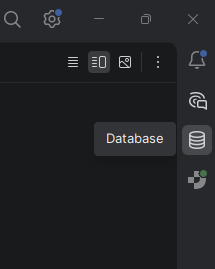
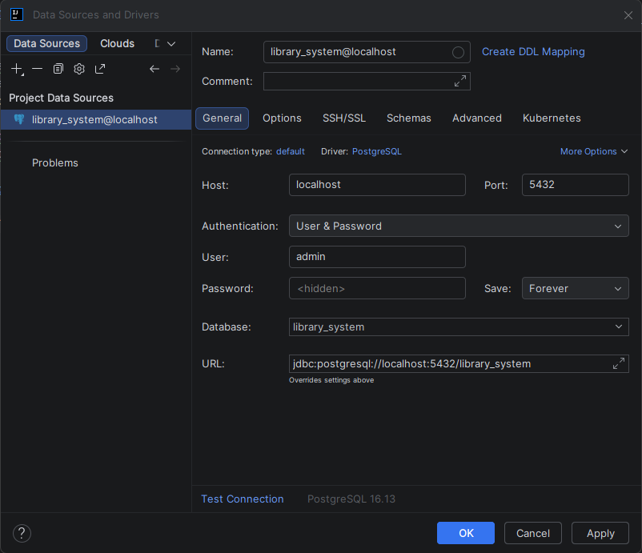

# Library Management System
Dieses Projekt nutzt Docker, um eine vorkonfigurierte PostgreSQL-Datenbank bereitzustellen.

## Voraussetzungen
* [Docker Desktop](https://docs.docker.com/desktop/setup/install/windows-install/)

## Setup
1. Stelle sicher, dass **Docker Desktop** läuft.
2. Öffne ein Terminal im Projektverzeichnis.
3. Führe den Befehl: `docker-compose up -d`

## Datenbank-Verbindung (IntelliJ)
1. Wähle in der Seitenleiste rechts `Database` aus.

2. Klicke auf `+`, `Data Source`, `PostGreSQL`
4. Sollte unten eine Warnung `Download missing driver files` sein, klicke auf `Download`.

3. Konfiguriere wie folgt:
    * Host: `localhost`
    * Port: `5432`
    * Database: `library_system`
    * User: `admin`
    * Password: `admin`

